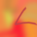
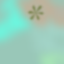

# Character Classisfication OCR

### Overview

This repository is used to convert images of ascii characters to text using tensorflow.

Characters can be one of 94 classes - `[0-9][A-Z][a-z]` and symbols such as `(+-./|` etc.

Images must be a size of `64x64 px` - Images of different sizes should be resized to `64x64`, not padded. Padding does not work so well if the models are trainined using the randomly generated [dataset](#dataset).

### Implementation

This OCR is implemented using Tensorflow 2.x.

There are a number of [pre-made models](character_classification/nn_models.py) which can easily be trained on a generated dataset.

### Dataset

The file [utils/img_to_dataset.py](utils/img_to_dataset.py) can be used to convert the [chars74k](http://www.ee.surrey.ac.uk/CVSSP/demos/chars74k/) data ([Download link](http://www.ee.surrey.ac.uk/CVSSP/demos/chars74k/EnglishImg.tgz)) to a Tensorflow dataset able to be used with the project.

Images can also be manually synthesized with [data_generation/create_images.py](data_generation/create_images.py). This will save the data to the [data](data) directory by default. You can specify whether you want to save the generated images as raw `.png` files, or as Tensorflow datasets which are automatically saved and can be loaded to train the models with.

Here are some examples of the randomly generated images:

The file [utils/manually_classify.py](utils/manually_classify.py) is provided for you to have a go at manually classifying these images to get an idea of human level performance.
